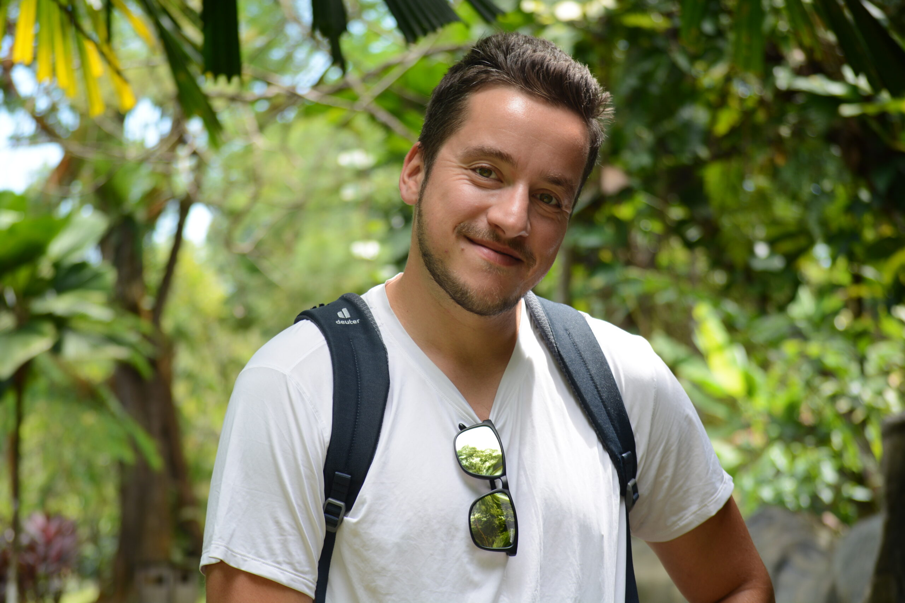

  

  

    <h1 class="profile-name">Georgi Kostov</h1>
    
Senior Unity Developer | Educator | XR Enthusiast | Cinema Geek

    

      
      
    

  

In my professional experience I have worked on games and simulations in a variety of fields: XR, education, climate change, agriculture, logistics, digital twins, city planning, sport, health and civil courage. I am an experienced Unity3D developer with 10 years of practice in every stage of development – concept, design, programming, UX, graphics, publishing, analytics. In addition, I have recently embraced the role of lecturer, guiding and mentoring several student projects each year.

In my free time I love traveling, cycling, hiking, swimming, spending time with friends and family. I am an avid gamer, sometimes write film critique and always aim to learn something new about the world, which I can reflect in my projects.

  <a href="{{ '/pages/projects/' | relative_url }}" class="link-card">
    <h3>Projects</h3>
    
Explore my work in XR, games, and simulations.

  </a>
  <a href="{{ '/pages/blog/' | relative_url }}" class="link-card">
    <h3>Blog</h3>
    
Read articles and insights on technology and design.

  </a>
  <a href="{{ '/pages/publications/' | relative_url }}" class="link-card">
    <h3>Publications</h3>
    
Discover my research and academic contributions.

  </a>

---

## Professional Timeline
<ul class="timeline">
  
    <li class="timeline-item">
      
{{ item.duration }}

      

        <h3>{{ item.role }}</h3>
        
<strong>{{ item.title }}</strong>

        <ul>
          
            <li>{{ point | strip }}</li>
          
        </ul>
      

    </li>
  
</ul>

---

## Teaching
I teach courses on games with a purpose, mixed reality and location-based technologies at the [University of Applied Sciences Upper Austria, Campus Hagenberg](https://fh-ooe.at/campus-hagenberg). The courses include a theoretical component, where core concepts from XR and game design are explored, and a practical component, where students develop projects throughout the semester under my mentorship. I also lead a making games with Unity workshop for the Master’s program in Interface Cultures at the [University of Art and Design Linz](https://www.kunstuni-linz.at/en/studies/degree-programmes/interface-cultures/master-programme/courses).

### Student Projects 2023/2024

    <iframe 
        src="https://www.youtube.com/embed/11QtNfz-3rc?si=LaHVU8-6pop8pJYK" 
        title="YouTube video player" 
        frameborder="0" 
        allow="accelerometer; autoplay; clipboard-write; encrypted-media; gyroscope; picture-in-picture; web-share" 
        referrerpolicy="strict-origin-when-cross-origin" 
        allowfullscreen>
    </iframe>

